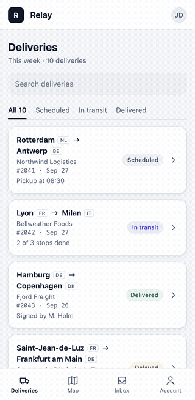

# morphcard

A card that grows into a full detail screen and shrinks back. The card's title, name and badge fly into the header, the content settles in, and Back plays a shorter version that ends on the card.

<p align="center">
  
</p>

**Docs and live demo: [morphcard.lucaspiera.com](https://morphcard.lucaspiera.com)**

- Framework-agnostic TypeScript, no runtime dependencies, Web Animations API.
- The detail screen opens by `clip-path` from the card's rectangle, so nothing stretches and `position: fixed` children stay put.
- Text that wraps differently on the card and in the header crossfades while it flies instead of scaling.
- Closing (300 ms) is quicker than opening (400 ms) and ends with the list.
- Closing during an open reverses the running animations from where they are.
- No flight when the card is off screen or the destination is missing; a fade instead.
- Reduced motion is opacity only. Focus moves into the sheet and back to the card.
- Optional React hook in `morphcard/react`.

## Install

Not on npm yet. Install from GitHub:

```bash
pnpm add github:pieralukasz/morphcard
```

## Use

```html
<main class="list">
  <article class="card" data-id="2042">
    <button aria-label="Open delivery 2042"></button>
    <h3 data-morph="title">Lyon → Milan</h3>
    <span data-morph="badge">In transit</span>
  </article>
</main>
<div class="scrim" data-morph-close></div>
<section class="sheet" role="dialog" aria-label="Delivery">
  <button data-morph-close data-morph-focus>Back</button>
  <h1 data-morph="title"></h1>
  <span data-morph="badge"></span>
  <div data-morph-stagger>…</div>
</section>
```

```js
import { createMorph } from "morphcard";

const morph = createMorph({
  sheet: document.querySelector(".sheet"),
  background: document.querySelector(".list"),
  scrim: document.querySelector(".scrim"),
  prepare: (card) => fillSheet(card?.dataset.id), // runs before measuring
});

document.querySelector(".list").addEventListener("click", (e) => {
  const card = e.target.closest(".card");
  if (card) morph.open(card);
});
```

```css
.sheet, .scrim { position: fixed; inset: 0; }
[hidden] { display: none !important; }
```

React:

```tsx
import { useMorph } from "morphcard/react";

const morph = useMorph();
// <main ref={morph.backgroundRef}>…</main>
// <div ref={morph.scrimRef} data-morph-close hidden />
// <section ref={morph.sheetRef} hidden>…</section>
// onClick={(e) => morph.open(e.currentTarget, () => setItem(item))}
```

See [Getting started](https://morphcard.lucaspiera.com/docs/getting-started) and the [API reference](https://morphcard.lucaspiera.com/docs/api).

## Develop

```bash
pnpm install
pnpm build          # dist/ with tsdown
pnpm typecheck
pnpm test           # unit tests (vitest)
pnpm test:e2e       # browser tests (Playwright, Chromium, desktop and phone)
pnpm serve          # examples at http://127.0.0.1:3301/examples/index.html
```

The browser tests run the demo in `examples/` at 1280×800 and 390×844. They cover open and close end states, reversing mid-transition, rapid clicks, reduced motion, missing and off-screen targets, scroll restore, focus return and leftover DOM. `scripts/record.mjs` records a transition frame by frame and `scripts/make-videos.sh` builds the videos used by the docs.

The docs site lives in `docs-site/` (Fumadocs, static export).

## Publishing

`package.json` is ready for npm (`exports`, types, `files`, `prepublishOnly` runs build, typecheck and unit tests). Publishing is one command: `pnpm publish`.

## License

MIT © Łukasz Piera
